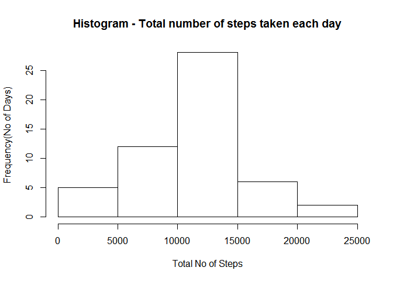
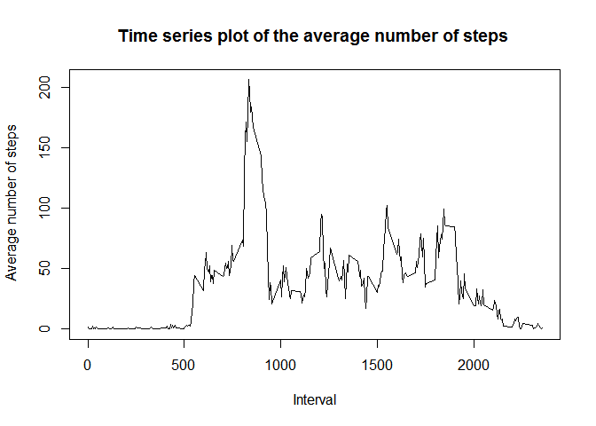
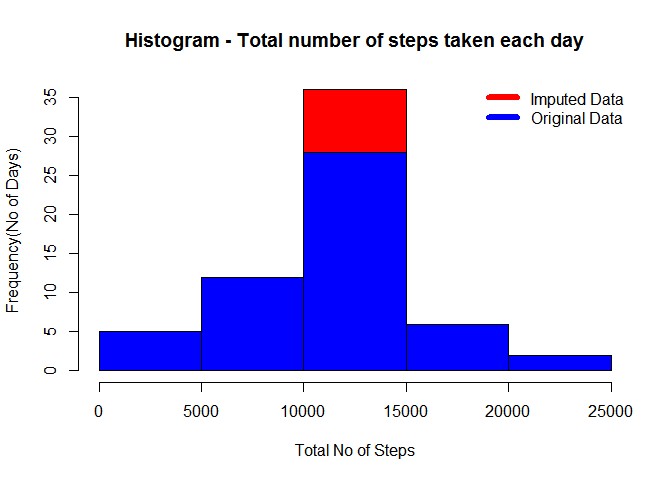
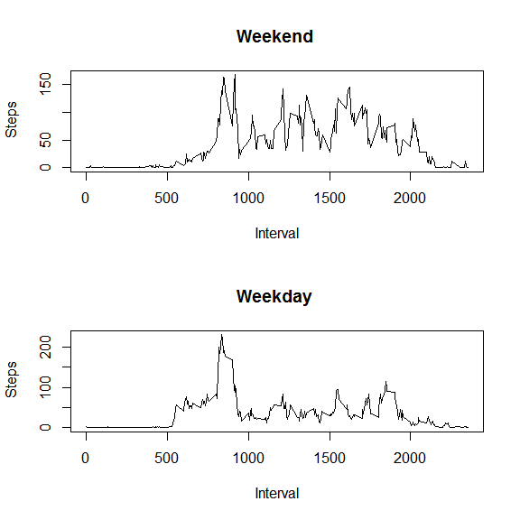

# Reproducible Research: Peer Assessment 1
Apoorv Saraf  
27 October 2016  


## Introduction

This is the first project for the Reproducible Research course in Coursera's Data Science specialization. In this project, data collected from a personal activity monitoring device is used.  Data was collected at 5 minute intervals through out the day during the months of October and November, 2012 and include the number of steps taken in 5 minute intervals each day. 
The data for this assignment can be downloaded from the course web site:
[Dataset: Activity monitoring data](https://d396qusza40orc.cloudfront.net/repdata%2Fdata%2Factivity.zip)

## Loading and preprocessing the data

1.Download and unzip the data.

2.Read data into data frame 'dat'.


```r
fileUrl <- "https://d396qusza40orc.cloudfront.net/repdata%2Fdata%2Factivity.zip"
download.file(fileUrl,destfile = "Activity monitoring data.zip")

unzip("Activity monitoring data.zip",exdir = "./Activity monitoring data")

dat <- read.csv("./Activity monitoring data/activity.csv")
```

## What is mean total number of steps taken per day?

1.Calculate the total number of steps taken per day.

2.Make a histogram of the total number of steps taken each day

3.Calculate and report the mean and median of the total number of steps taken per day


```r
StepsPerDay <- aggregate(steps~date,dat,sum) 

hist(StepsPerDay$steps,main = "Histogram - Total number of steps taken each day",
     xlab = "Total No of Steps", ylab = "Frequency(No of Days)")
```

<!-- -->

```r
MeanSteps <- mean(StepsPerDay$steps, na.rm = TRUE)
MedianSteps <- median(StepsPerDay$steps, na.rm=TRUE)
```

**The mean is 10766.19 and median is 10765**

## What is the average daily activity pattern?

1.Calculate average steps for each interval for entire data.

2.Make a time series plot of the 5-minute interval and the average number of steps taken, averaged across all days.

3.Find interval containing the maximum number of steps.


```r
MeanStepsPerInterval <- aggregate(steps~interval,dat,mean)

plot(MeanStepsPerInterval$interval,MeanStepsPerInterval$steps,type = "l",
     main = "Time series plot of the average number of steps ",
     xlab = "Interval", ylab = " Average number of steps")
```

<!-- -->

```r
MaxStepInterval <- MeanStepsPerInterval$interval[which.max(MeanStepsPerInterval$steps)]
```

**The 5-minute interval containing the maximum number of steps is 835**

##Imputing missing values

1.Calculate and report the total number of missing values in the dataset.

2.Assign mean interval value to missing data for that particular 5 min interval

3.Create a new dataset that is equal to the original dataset but with the missing data filled in.

4.Make a histogram of the total number of steps taken each day.

5.Calculate and report the mean and median total number of steps taken per day. 

6.Calculate difference of new mean and medians from that of non-imputed data.

7.Assess the impact of imputing missing data on the estimates of the total daily number of steps


```r
IncompleteDat<- sum(!complete.cases(dat))

NewDat <- merge(dat, MeanStepsPerInterval, by="interval")
NewDat$steps.x[is.na(NewDat$steps.x)] <- NewDat$steps.y[is.na(NewDat$steps.x)]

NewStepsPerDay <- aggregate(steps.x~date,NewDat,sum)

hist(NewStepsPerDay$steps.x,col="red",main = "Histogram - Total number of steps taken each day",
     xlab = "Total No of Steps", ylab = "Frequency(No of Days)")
hist(StepsPerDay$steps,col="blue",add=TRUE)
legend("topright", c("Imputed Data", "Original Data"), col=c("red", "blue"),lwd=6,bty = "n")
```

<!-- -->

```r
NewMean <- mean(NewStepsPerDay$steps.x)
NewMedian <- median(NewStepsPerDay$steps.x)

DiffMean <- NewMean - MeanSteps
DiffMedian <- NewMedian - MedianSteps
```

**The total no of missing values in the dataset are 2304**

**For imputed data the mean is 10766.19 and median is 10765**

**The diffrence in mean and median of original and imputed data is 0 and 1.19 repectively.**

**As observed from the above histogarm, imputed data has higher frequency in 10000 - 150000 step range.**

## Are there differences in activity patterns between weekdays and weekends?

1.Create a new factor variable in the dataset with two levels - "weekday" and "weekend"

2.Make a panel plot containing a time series plot of the 5-minute interval and the average number of steps taken, averaged across all weekday days or weekend days (y-axis).


```r
type <- function(date) {
  if (weekdays(as.Date(date)) %in% c("Saturday", "Sunday")) {"weekend"} 
  else {"weekday"}
}
NewDat$type <- as.factor(sapply(NewDat$date, type))

WeekendDat<- NewDat[NewDat$type=="weekend",]
WeekdayDat<- NewDat[NewDat$type=="weekday",]

WeekendStepsInterval <- aggregate(steps.x~interval,WeekendDat,mean)
WeekdayStepsInterval <- aggregate(steps.x~interval,WeekdayDat,mean)

par(mfrow=c(2,1))
plot(WeekendStepsInterval$interval,WeekendStepsInterval$steps.x,type = "l",
     main = "Weekend ",
     xlab = "Interval", ylab = " Steps")
plot(WeekdayStepsInterval$interval,WeekdayStepsInterval$steps.x,type = "l",
     main = "Weekday ",
     xlab = "Interval", ylab = " Steps")
```

<!-- -->
